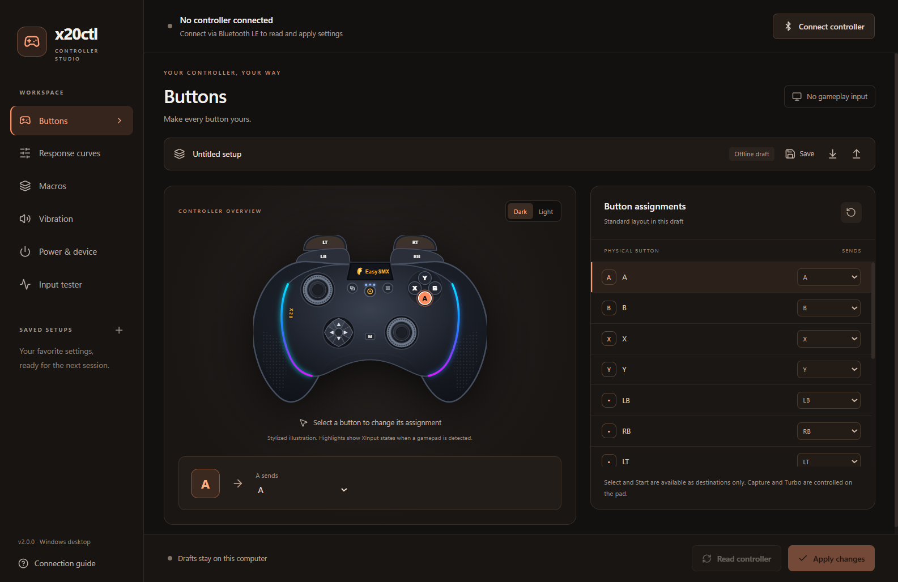
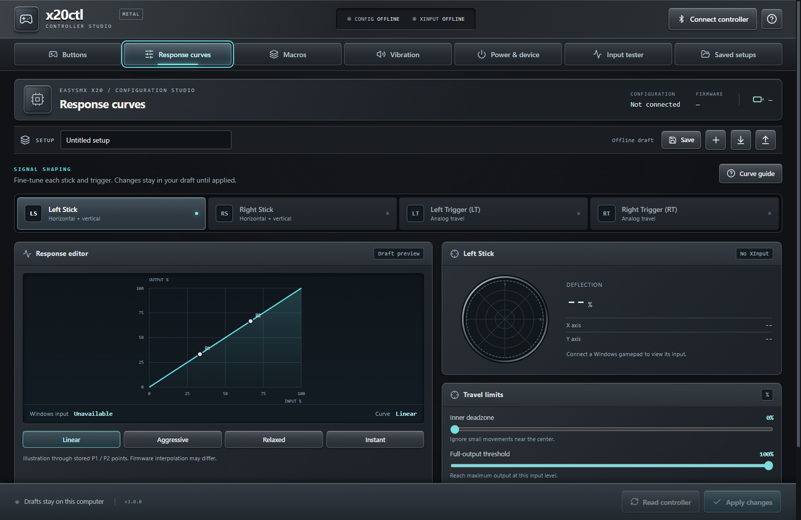
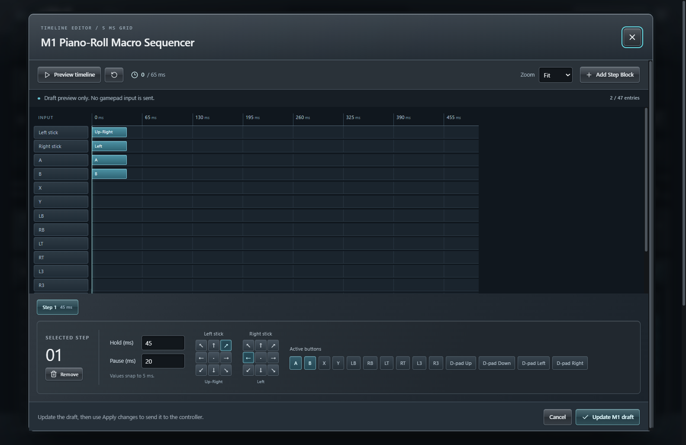
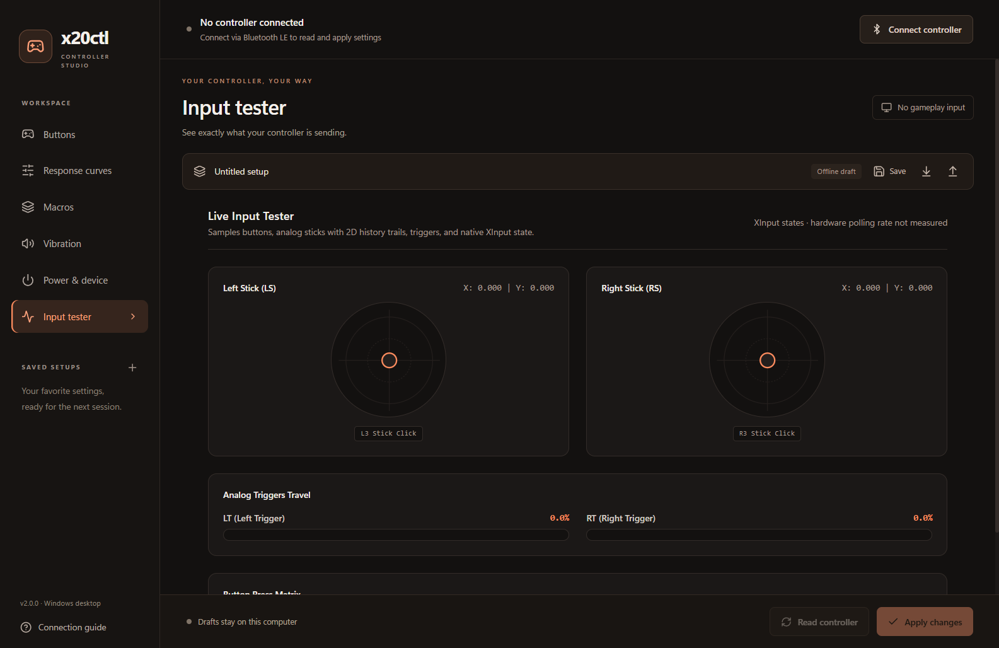
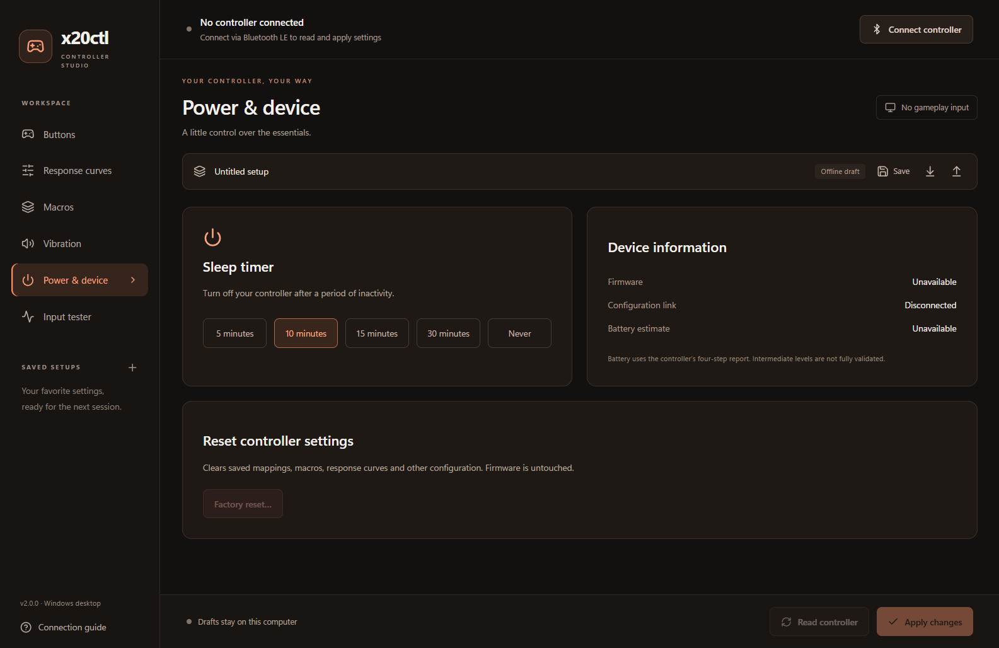

# x20ctl

### Your controller. Your setup. A real Windows app.

A downloadable desktop configurator for the **EasySMX X20**. Remap buttons, tune response curves, build paddle macros and save your favorite setups, all in one local application.

[Download for Windows](https://github.com/AmjadAAYD/x20ctl/releases/latest) · [Changelog](CHANGELOG.md) · [Connection help](IF-YOUR-CONTROLLER-ISNT-WORKING.md) · [Report an issue](https://github.com/AmjadAAYD/x20ctl/issues)



## Download and run

1. Open [GitHub Releases](https://github.com/AmjadAAYD/x20ctl/releases).
2. Download **x20ctl.exe**, not the source-code archive.
3. Run it. No Python, Node.js, browser tab, account or paid service is needed.

Windows 10/11 **x64** is the target. The full executable bundles Python, the compiled interface and a Microsoft WebView2 fallback. It prefers the serviced system WebView2 runtime when available. The full download is larger because it includes that fallback; first launch takes time to unpack it. Windows .NET Framework 4.6.2 or later is required, as included in supported, updated Windows installations.

The executable is **unsigned**. A Windows reputation warning is possible. Verify its SHA-256 against the release's `SHA256SUMS.txt`; do not disable antivirus to run it. [Security details](SECURITY.md).

## Two connections, clearly separated

| Connection | What it does |
|---|---|
| Bluetooth LE configuration peripheral, usually **Xpert2** | Reads and writes controller settings through the native KeyLinker client |
| USB, receiver or Windows-compatible Bluetooth gameplay mode | Feeds the read-only **XInput** tester and macro recorder |

Playing over USB does not establish the configuration link. Enable your PC's Bluetooth, wake the controller and select **Connect controller**. The app lists actual discovery results, then reads settings after a successful connection.

**X05 is not supported.** Its hardware does not expose this configuration protocol. Other KeyLinker devices are not claimed compatible merely because they appear in a scan. See the [hardware investigation](docs/00-findings.md#7-other-controllers-checked).

## Inside the app

- **Button studio:** selectable controller illustration, per-button assignments and dark/light illustration styles. Select and Start are destinations only; unsupported Capture/Turbo mappings are not offered.
- **Response curves:** independent left/right stick and trigger control points, deadzones and presets. Curve lines are illustrations through stored points, not measurements of unknown firmware interpolation.
- **Paddle macros:** M1 to M4, button chords, eight-way stick directions, per-step timing, loop intervals and a piano-roll editor. Timing follows the controller's 5 ms grid; the limit is 47 wire entries, including pauses.
- **Real recording:** records XInput buttons and left-stick directions into the M1 draft. Review before applying. Recording is not fabricated, and overflow/disconnection is an error rather than silent truncation.
- **Vibration and power:** stored motor strength and idle shutdown timer. No pretend rumble test.
- **Input tester:** actual Windows XInput states. No invented polling rate, packet loss or latency measurement.
- **Saved setups:** native local storage, JSON import/export, legacy 1.x profile migration, rename and delete. Importing a partial legacy setup does not overwrite categories it never contained.
- **Desktop behavior:** single instance, close-to-tray, Open/Quit tray actions and optional quiet GitHub update checks.

Offline edits are **drafts**, not controller values. **Apply changes** writes only edited categories. Successful read-back is reported as verified; commands without reliable confirmation are labeled sent. A partial failure retains the remaining draft and reports what succeeded.

## Real screenshots

These are captures of the running packaged desktop app's native WebView2 surface, not AI-generated product images. They show the disconnected/offline state honestly. The controller drawing inside the app is a stylized illustration, not a photograph.

| Response curves | Macro editor |
|---|---|
|  |  |

| Input tester | Power and device |
|---|---|
|  |  |

Capture method and verification scope: [desktop validation](docs/desktop-validation.md).

## Local first

Settings are stored under `%APPDATA%\x20ctl\desktop`. Existing 1.x profiles under `%APPDATA%\x20ctl\profiles` are not moved or deleted. Import them from the setup toolbar.

The optional startup update check contacts GitHub's public latest-release API. Disable it in **Connection guide**. Controller data and profiles are not uploaded. Updates open the real GitHub Releases page; the app never silently replaces its executable.

The embedded Microsoft WebView2 component has its own diagnostic/security behavior, including Microsoft Defender SmartScreen, and may send information to Microsoft under [Microsoft's privacy statement](https://aka.ms/privacy). This is separate from x20ctl's update check. See [third-party notices](THIRD_PARTY.md).

The React interface is bundled inside the EXE and talks to a restricted Python API. It is **not a hosted website or PWA**. Native BLE and XInput access stay in Python. The embedded view cannot navigate to arbitrary remote content.

## What changed from 1.2.0?

The verified Python protocol engine, CLI, hardware findings and regression suites are retained. The primary interface is now a new local React desktop studio with a native bridge. The intervening browser prototype and Tkinter mock were removed, along with fabricated recording, unsupported telemetry, synthetic marketing screenshots, fake checksums and false attestation claims.

Version 2.0 has software and executable acceptance tests. The 2.0.1 follow-up was also tested with a live Xpert2 controller on firmware 9.01: full settings reads, a timer write/read-back/restore, live XInput changes and saving the connected setup passed. Macro playback and every individual control have not been verified. See the [hardware test record](docs/desktop-validation.md#live-controller-follow-up-201). Version [1.2.0](https://github.com/AmjadAAYD/x20ctl/releases/tag/v1.2.0) remains available as a rollback.

## Run from source

Use Python 3.12 and Node.js 22.18 or later on Windows:

```powershell
git clone https://github.com/AmjadAAYD/x20ctl.git
cd x20ctl
python -m venv .venv
.venv\Scripts\python -m pip install -r requirements-build.txt
npm ci
npm run build
.venv\Scripts\python app.py
```

Source launch uses the system WebView2 runtime. `npm run dev` is an **interface development preview only** and cannot configure hardware without the desktop bridge.

## Tests and builds

```powershell
npm run lint
npm test
.venv\Scripts\python -m pytest tests/test_desktop.py tests/test_protocol.py tests/test_profiles.py tests/test_compatibility.py -q
.venv\Scripts\python tools/build_exe.py --bundled-runtime
$p = Start-Process .\dist\x20ctl.exe -ArgumentList '--smoke-test artifacts\acceptance --bundled-runtime' -Wait -PassThru
$p.ExitCode
```

The full regression suite also includes the retained Qt interface: install `.[gui]` to run all tests with `python -m pytest -q`. Qt is excluded from the new executable.

`--smoke-test` uses isolated profile storage, exercises the actual desktop UI, captures rendered pixels and performs only read-only discovery/input checks. It never writes controller settings. Build dependencies are pinned in [requirements-build.txt](requirements-build.txt); frontend dependencies are locked in `package-lock.json`.

Build output is `dist/x20ctl.exe`. [Architecture and profile schema](docs/desktop-architecture.md). [Protocol reference](docs/01-protocol.md).

## Safety and credits

The app targets configuration, not firmware. There is no firmware-flashing workflow. Configuration writes can still affect controls, so save your setup first and review changes. A reset erases controller configuration; it is not a universal recovery guarantee.

Thanks to [@SpookyyQ](https://github.com/SpookyyQ) for testing the X05 and documenting its protocol boundary. Existing protocol findings and Git history are preserved.

MIT for x20ctl source. Bundled components retain their own licenses, including Microsoft's runtime: [third-party notices](THIRD_PARTY.md). Independent interoperability project, not affiliated with or endorsed by EasySMX or any controller manufacturer.
