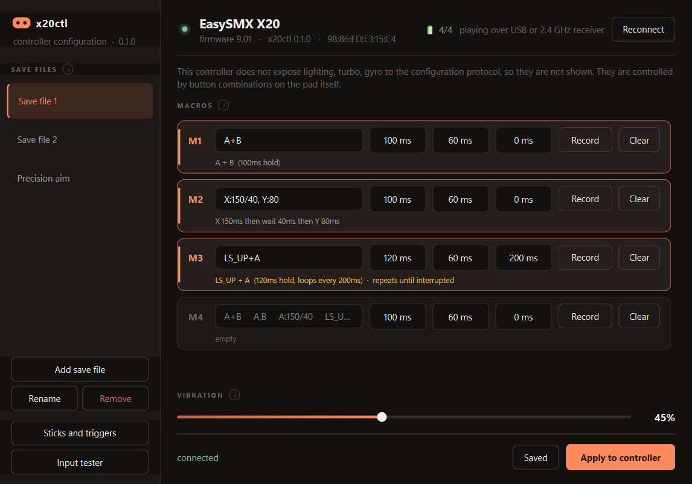
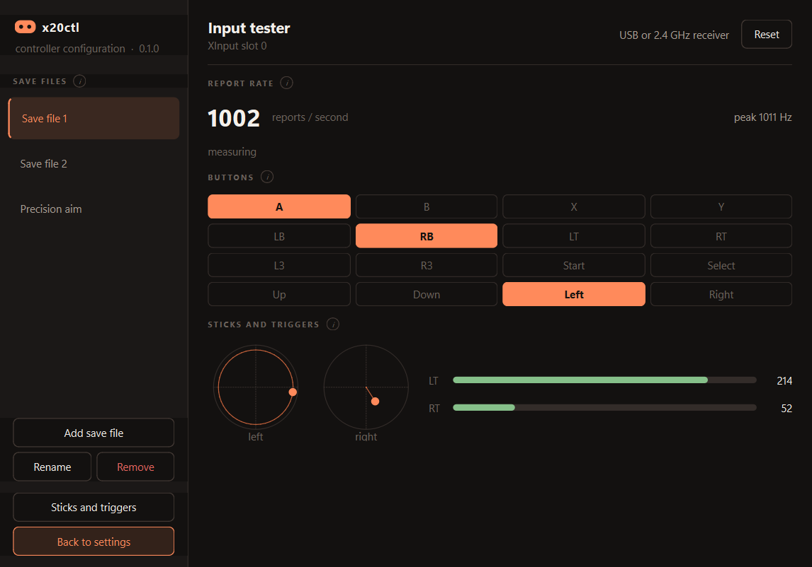
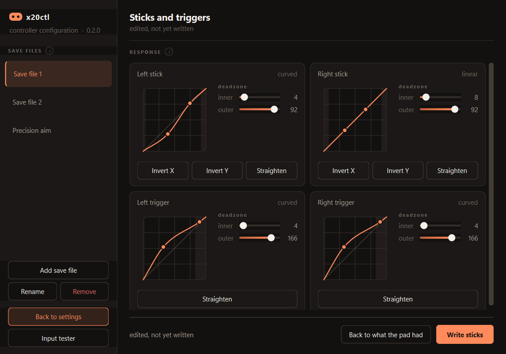

# x20ctl

Open configuration for the EasySMX X20 gamepad, and for other controllers
speaking the same KeyLinker protocol.

The X20 ships with no desktop configuration software. The vendor provides a
manual, a driver, and a firmware updater. Everything else lives in a mobile-only
app or behind button combinations on the pad itself. This project documents the
protocol and makes it usable from a PC.

**Working today:** macros on all four rear buttons, vibration strength, battery
level, a live input tester and a polling-rate meter, driven from a desktop app or
the command line, plus stick and trigger deadzones and response curves. See
[status](#status) for exactly what is and isn't proven.

The protocol was reverse engineered from scratch. No prior documentation of
KeyLinker, `Xpert2`, or `com.pulsenet.inputset` appears to exist publicly.



Macros on the four rear buttons, with per-step timing, save files, and vibration.



The input tester: every button, both sticks with a position trail, the analog
triggers, and a meter counting the reports per second that actually reach
Windows.



Deadzones and response curves, one editor per channel. The dotted diagonal is a
linear response, and both control points are dragged directly.

---

## Safety

The controller has two entirely separate command channels:

| Channel | Mechanism | Risk | Policy |
|---|---|---|---|
| Bootloader | USB mass storage, SCSI pass-through | **can brick the device** | never touched |
| Configuration | BLE GATT | recoverable | the only target |

### Rules this project follows

1. **No SCSI, ever.** No `\\.\PHYSICALDRIVE`, no drive letters, no running the
   vendor updater. The bootloader is permanently out of scope.
2. **Never enter upgrade mode** (`L3` held while connecting USB).
3. **Read before writing.** Every write is traceable to a captured read or to the
   vendor app's own code. Nothing is guessed.
4. **Tools refuse unsafe opcodes by default.** `ble_query.py` and `ble_probe.py`
   accept only read-only opcodes. `verify_write.py` can construct exactly one
   packet, a provable no-op. `set_vibration.py` always reads first and reuses
   undecoded bytes verbatim instead of inventing values.

**Recovery from any settings-level mistake: hold `C` for 5 seconds** for a
factory reset. Settings live separately from firmware.

### On firmware updates

This project won't flash firmware, and that's deliberate instead of
unfinished. Flashing runs through the mass-storage bootloader, which is the one
path that can destroy the controller. Use the manufacturer's own updater for
that. `x20 status` reports the installed firmware version so you can tell when
you're behind.

---

## Status

| Feature | State |
|---|---|
| BLE transport, framing, CRC, scrambling | confirmed against hardware |
| Reading device info, capabilities, every setting | working |
| **Macros on M1-M4** | **working**, verified by behaviour |
| ... sequences, chords, stick directions | working |
| ... multi-packet macros via chunked writes | working |
| **Vibration strength** | **working**, verified by feel at 0%, 30%, 100% |
| **Battery level** | **working**, four-step gauge plus charging flag, re-read on a timer rather than once at connection |
| Save files | working |
| Recording from live input | working |
| Input tester and polling meter | working |
| **Stick deadzones and curves** | **working**, verified by writing a deadzone and reading it back changed, then restoring it |
| **Trigger deadzones and curves** | **working**, same record layout, verified the same way |
| RGB lighting | **not exposed by the X20** |
| Turbo | **not exposed by the X20** |
| Gyro | **not exposed by the X20** |
| Firmware update | **deliberately out of scope**, see Safety |

### About the three "not exposed" rows

The pad reports its own capabilities in a descriptor that the official app uses to
decide which settings pages to show. An X20 reports zero for lighting, turbo and
gyro. Those features exist in the hardware but are driven entirely by on-pad
button combinations, and aren't reachable through this protocol on this model.

This is a property of the controller, not a limitation of this software. Another
brand's pad on the same chip may well report them as available, and this library
gates on that descriptor, so it will simply work.

---

## Install

**Windows, and Python 3.10 or newer.** The Windows requirement is real rather
than incidental: the input tester and the polling meter read the pad through
`XInput1_4.dll` directly, save files go to `%APPDATA%`, and the taskbar icon is
set through a Windows shell call. It won't run elsewhere as it stands.

Two parts of it aren't Windows-bound, if you want to port it. The protocol
library is pure computation with no I/O at all, and the BLE transport goes
through [bleak](https://github.com/hbldh/bleak), which supports Linux and macOS.
What would need writing is a replacement for the XInput reader, since that's
where the platform is baked in.

**Pair the controller over Bluetooth.** Settings travel over a Bluetooth LE link
that the pad exposes separately from however you play, so Bluetooth is needed to
change anything even when you are on a cable or the 2.4GHz receiver. Playing is
unaffected, and the input tester works without it.

```bash
pip install -e ".[gui]"
```

That puts two commands on your PATH, so neither needs you to be in this
directory:

| Command | What it does |
|---|---|
| `x20ctl` | opens the desktop app |
| `x20` | the command line interface |

Without installing, run them as `python -m x20ctl.gui` and `python -m x20ctl`
from the project directory.

---

## The desktop app

```bash
x20ctl
```

Save files down the left, the four macro slots and vibration on the right. The
header shows battery, and which link the pad is being played over.

Editing a slot validates as you type, and a macro set to loop is marked, since
that's the one setting that can surprise you. Every section has an info button
explaining what its controls do and why.

**Edits save themselves**, and the Save button shows whether anything is
pending, so you can press it when you want to be sure. The app only interrupts
when you clear a slot that held a macro, and then it offers to put it back,
because a macro already written to the controller can't be read off it again.

**Record** on any slot captures what you press on the controller, with the real
timing between presses, and fills the slot in.

**Sticks and triggers** is a page of its own, with a deadzone pair and a
draggable response curve for each of the four channels. Nothing is written until
you press Write, and what the controller reports afterwards is what the page then
shows. See [sticks and triggers](#sticks-and-triggers).

**Input tester** shows every button lighting as it's held, both sticks with a
position trail, and the triggers' analog values, alongside a meter counting how
many reports per second actually reach Windows. The trail is what makes stick
behaviour visible: rolling around the edge should trace a clean circle, and a
released stick should settle dead centre.

Applying makes the controller match the save file exactly, so switching between
save files really switches. Any slot the file leaves empty is cleared on the pad.
Settings the controller doesn't expose are skipped rather than attempted, and
the app says which.

---

## Sticks and triggers

Four channels, each with two deadzones and a response curve.

The **inner deadzone** is the slack around the centre the controller ignores,
which is what to raise if a released stick drifts and what to lower for finer
aim. The **outer deadzone** is where travel starts counting as fully pressed. An
X20 ships with 8 and 92 out of 100 on both sticks.

The **curve** is two control points. On the diagonal the response is linear:
output matches movement. Above it the controller moves faster than your thumb,
below it more gently. An X20's sticks are linear out of the box and its triggers
are not, sitting at `(82,133)` and `(229,235)`, ramping faster than linear.

Drag either point in the app, or set them exactly from the command line:

```bash
x20 curve                              show both records
x20 curve sticks --inner 4             widen the usable travel
x20 curve triggers --linear            straighten the response
x20 curve sticks --side left --invert-y
```

Two things are worth being straight about.

**Writing is confirmed on both records.** A left-stick deadzone was written from
8 to 10 and a left-trigger deadzone from 4 to 6, each read back changed with the
right channel untouched, and each restored byte for byte. Every write reads the
record back and tells you whether the controller reports what it was sent,
saying the controller kept its own values rather than claiming success if it
doesn't. Anything changed can be put back: the app keeps the values read at
connection, and the command line prints a `--restore` line before each write.

**The line drawn between the control points is this app's own.** The points are
read and written exactly, but nothing documents how the firmware interpolates
between them, so the curve is drawn as a smooth monotone interpolation through
them. It's a faithful picture of the points, not a claim about the hardware's
arithmetic.

---

## Save files

A save file is a set of up to four macros and a vibration level, stored as JSON
in `%APPDATA%\x20ctl\profiles`. The controller has four fixed macro slots and
knows nothing about save files; switching files rewrites those slots.

**Save files belong to you, not to the app.** They live in your own profile
directory, nowhere near the executable, so replacing `x20ctl.exe` with a newer
download leaves every save file exactly where it was. That matters more than it
sounds for a single-file build: anything stored beside the executable would
land in a temporary folder that's deleted the moment the app closes.

```json
{
  "name": "Save file 1",
  "vibration": 30,
  "macros": {
    "M1": { "keys": "A+B", "hold_ms": 100, "gap_ms": 60, "loop_ms": 0 },
    "M2": { "keys": "X,Y", "hold_ms": 120, "gap_ms": 80, "loop_ms": 0 },
    "M3": null,
    "M4": null
  }
}
```

In a key sequence, `+` presses keys together and `,` plays them one after
another, so `A+B` is a chord and `A,B` is a sequence. Sticks are written as a
direction, `LS_UP` or `RS_DOWN_LEFT`, and compose with the rest: `LS_UP+A` pushes
the left stick up while holding A.

Fourteen buttons can appear in a macro: A, B, X, Y, LB, RB, LT, RT, L3, R3 and
the four d-pad directions, plus both sticks. Select, Start and Home can't: the
pad's own macro key list omits them.

Each step can carry its own timing, which is what the hardware stores:

- `A:150` holds A for 150 ms
- `A:150/40` holds 150 ms, then waits 40 ms before the next step
- `A:150, B` times each step independently

Steps without their own timing fall back to the three defaults:

- `hold_ms`: how long each press lasts. 50 ms is faster than a human can press
  and some games poll slowly enough to miss it; 80 to 120 ms is more reliable.
- `gap_ms`: the pause between presses, which games that debounce input need.
- `loop_ms`: an **interval, not a duration**. `0` fires the macro once; anything
  else repeats it forever until another macro button is pressed. The hardware has
  no "repeat for N seconds" setting.

All three snap to multiples of 5 ms, which is the controller's own resolution.

---

## Command line

```bash
x20 scan
x20 status
x20 vibration 60
x20 curve sticks --inner 4
x20 macro M1 "A+B" --hold 100
x20 profile set "Save file 1" M1 "A+B" --vibration 30
x20 profile apply "Save file 1"
```

The address is remembered after the first successful scan, so most commands need
no arguments. `x20 --version` reports this tool's version; `x20 status` reports
it alongside the controller's firmware, which is a different number.

---

## Low-level tools

Find the controller. It advertises as `Xpert2`, on a MAC distinct from the one it
uses for the gamepad interface:

```bash
python tools/ble_scan.py
```

Inspect its GATT table:

```bash
python tools/ble_enum.py <address>
```

Read a setting:

```bash
python tools/ble_probe.py <address> HOST_MOTOR --label baseline
```

Read every setting at once:

```bash
python tools/ble_sweep.py <address> --opcodes HOST_STICK,HOST_TRIGGER,HOST_MOTOR
```

Read and change vibration strength:

```bash
python tools/set_vibration.py <address>
python tools/set_vibration.py <address> --percent 60
python tools/set_vibration.py <address> --restore 4c
```

Prove the pad accepts a curve write, and put it straight back. This is how the
results in [status](#status) were obtained, and it's worth running on any
controller that isn't an X20:

```bash
python tools/verify_curve_write.py sticks --read-only
python tools/verify_curve_write.py triggers
```

Run the tests, no hardware required:

```bash
python tests/test_protocol.py
```

---

## The protocol, in brief

Full detail in [docs/01-protocol.md](docs/01-protocol.md).

**Transport.** BLE GATT. Service `d7f010e0-660d-46e9-96c3-19c4148bdab5`, write on
`...e1`, notify on `...e2`. The pad advertises this as a separate peripheral
alongside its gamepad interface, so both are live at once.

**Packets.** `[opcode][length][serial][nonce][payload][crc8]`, capped at 20 bytes
to fit a default BLE MTU, then passed through a scrambling pass. Replies use a
single `RESPONSE` opcode and are matched to requests by the serial byte.

**Checksum.** Reflected CRC-8, polynomial `0xEB`. The table is generated from the
polynomial and asserted equal to the one shipped in the vendor app on every test
run.

**Payloads.** Byte 0 of every response is a length prefix. Records longer than one
packet are chunked and fetched by index.

---

## Layout

```
docs/       protocol documentation and the reverse engineering log
tools/      discovery and configuration utilities
x20ctl/     the protocol library
tests/      offline tests, including bytes captured from real hardware
vendor/     manufacturer binaries, analysis only, never committed
captures/   packet logs, never committed
```

---

## Notes for other devices

The protocol belongs to the chip vendor (ShenZhen ZhiXu, package
`com.pulsenet.inputset`), not to EasySMX, so it likely covers controllers from
several brands. Two things to know before pointing this at other hardware:

- **Don't identify a pad by USB VID/PID.** The X20 clones Microsoft's
  `045E:028E` when wired and `045E:02FD` over Bluetooth Classic. Matching on those
  would target genuine Xbox controllers. Identify by the BLE peripheral instead.
- **Always read the capability descriptor first** and honour it. It's how the pad
  tells you which settings it will accept.

---

## Is the executable safe

You don't have to take my word for it, and you shouldn't have to.

`x20ctl.exe` is a PyInstaller one-file build of the source in this repository,
produced by [tools/build_exe.py](tools/build_exe.py). Three ways to check it,
in increasing order of how little you have to trust me:

**1. Verify you got what was published.** Every release lists a SHA-256.

```powershell
Get-FileHash .\x20ctl.exe -Algorithm SHA256
```

| Release | SHA-256 |
|---|---|
| 0.2.0 | `611207f6b7605c04d20402e05f2bf34d368fbf66d681644a95730c44ee3ee4e5` |

**2. Scan it yourself.** Upload it to [VirusTotal](https://www.virustotal.com/)
and read which engines object and what they claim to have found.

**3. Don't use the binary at all.** `pip install -e ".[gui]"` runs the same
application from source, which you can read.

**On antivirus warnings.** A one-file PyInstaller build carries a Python
interpreter inside it and unpacks itself to a temporary folder when it starts.
Several engines flag that shape by itself, and the binary is unsigned because
code-signing certificates cost money this project doesn't have. So a generic
heuristic detection here is common and isn't evidence of much. A detection
naming specific behaviour would be, and I'd want to hear about it — see
[SECURITY.md](SECURITY.md).

What the program actually does is bounded and documented: it speaks BLE GATT to
the controller's configuration service, reads and writes gamepad settings, and
reads XInput for the input tester. It has no network code, and no path to the
controller's bootloader. See [Safety](#safety).

## Licence

MIT, see [LICENSE](LICENSE).

This is an independent interoperability project, not affiliated with or endorsed
by any manufacturer. No vendor firmware, application binaries, or decompiled
source are distributed here.
