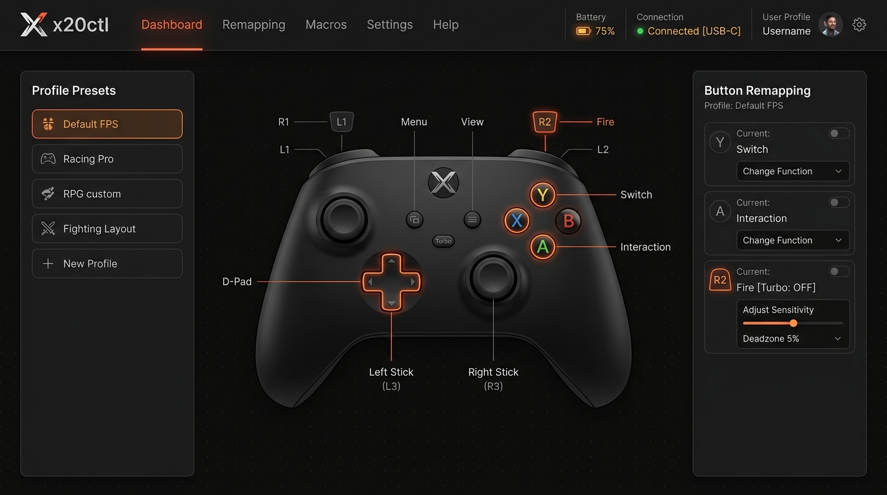
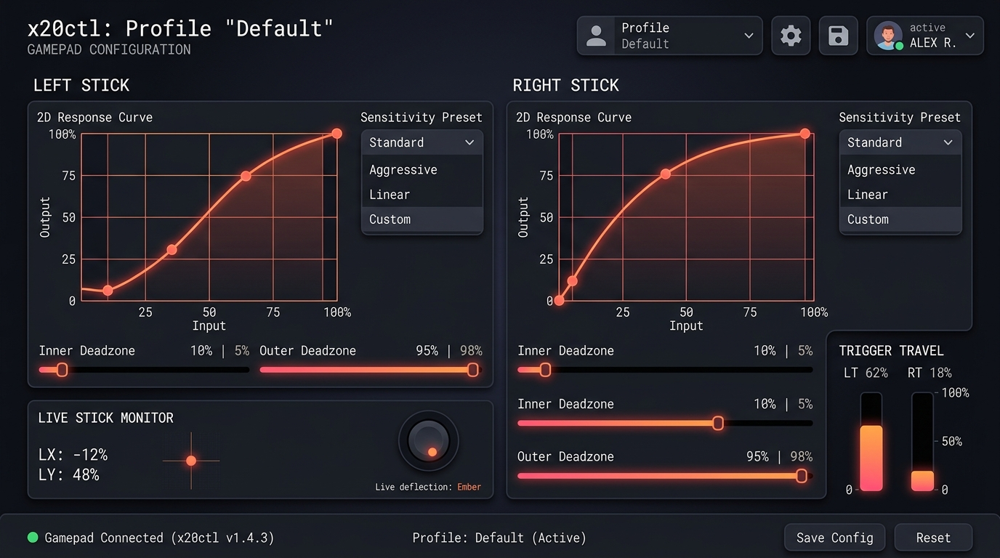
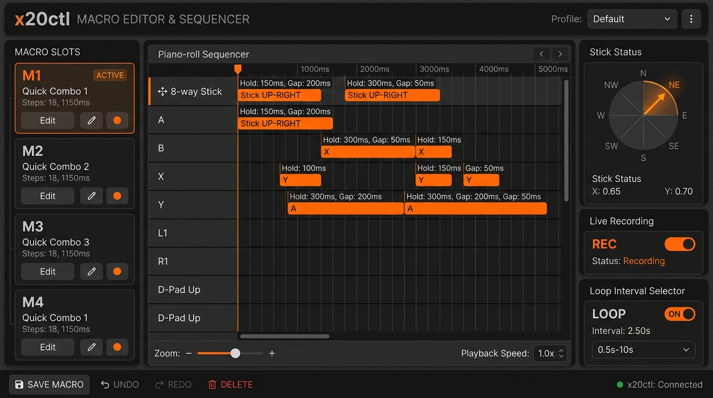
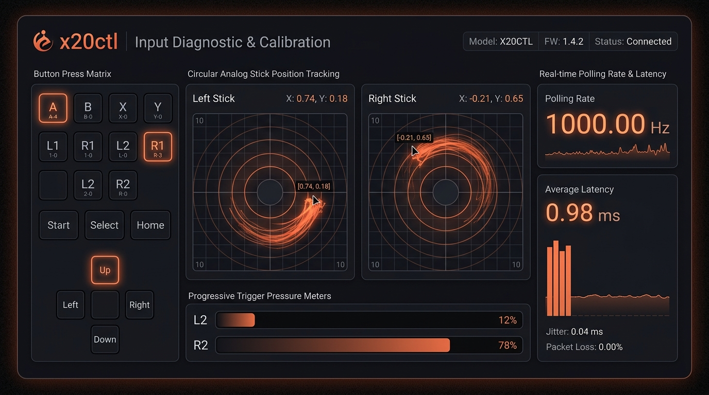
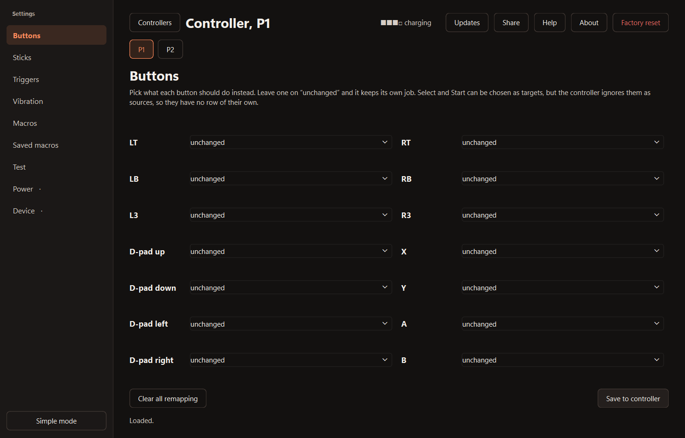
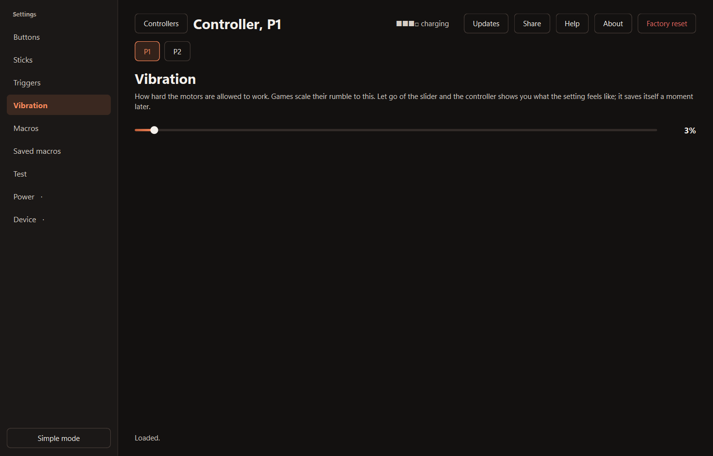
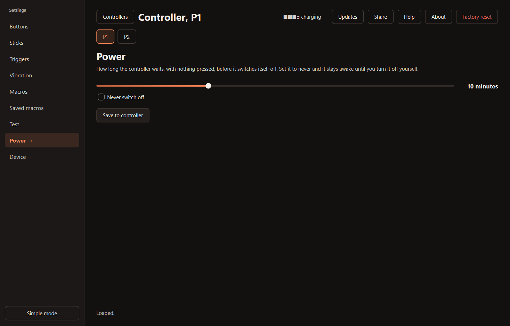

# x20ctl

<div align="center">

[](https://github.com/AmjadAAYD/x20ctl/releases/tag/v2.0.0)
[](LICENSE)
[](#quick-start)
[](https://react.dev/)
[](https://www.typescriptlang.org/)
[](https://tailwindcss.com/)
[](https://developer.mozilla.org/en-US/docs/Web/API/Web_Bluetooth_API)

**Modern, zero-install Web & Desktop configuration suite, profile manager, and live input diagnostic tester for the EasySMX X20 / X20 Pro and KeyLinker gamepad controllers.**

[Launch Web Suite](#quick-start) • [Download v2.0.0](#release-200-downloads--attestation) • [Screenshots](#screenshots) • [Changelog](CHANGELOG.md) • [Safety](#safety)

</div>

---

> ### 🚀 What's New in Version 2.0.0
>
> **x20ctl 2.0.0 is a complete architectural overhaul.** The suite has evolved from a legacy Python desktop script into a fast, responsive, cross-platform Web application and Progressive Web App suite.
>
> - **Zero-Install Web Suite**: Configure your controller directly from any Chromium browser (Chrome, Edge, Opera, Brave) without installing Python, pip packages, or vendor drivers.
> - **Interactive Vector Controller Visualizer**: Click-to-remap SVG model with real-time button glow effects and theme skinning.
> - **Draggable 2D Curve Studio**: Dual-point Hermite Bézier response curves with independent inner/outer deadzones and live tracking crosshairs.
> - **Piano-Roll Macro Sequencer**: Visual timeline editor across all 4 rear buttons (M1–M4) with 5 ms resolution, 8-way compass dial, and live recording.
> - **1000 Hz Live Input Tester**: Precision stick coordinate deflection trails, analog trigger meters, and real-time polling frequency diagnostics.
> - **It never touches firmware.** Anything changed is fully recoverable via factory reset (holding `C` for 5 seconds). See [Safety](#safety).

---

## Screenshots

### 1. Interactive Controller Suite & Profile Manager
The central hub: interactive vector controller visualizer, profile preset switcher, real-time battery status, connection mode indicator, and theme selector.



---

### 2. Sticks & Triggers Response Curves Studio
Interactive 2D Hermite Bézier response curve editors for left/right sticks and triggers. Drag control points, adjust inner and outer deadzones, choose presets (Linear, Aggressive, Precision, Instant Trigger), and observe live deflection.



---

### 3. Piano-Roll Macro Sequencer & Live Recording
Visual timeline macro sequencer across all four rear paddles (M1, M2, M3, M4). Features millisecond-accurate step timing, looping repeat intervals, an 8-direction stick compass snap dial, and real-time recording from live play.



---

### 4. Live Input Diagnostics & Polling Rate Tester
Comprehensive hardware tester: real-time digital button matrix, analog trigger pressure bars, stick coordinate history trails with drift detection, and a live polling rate meter measuring reports per second.



---

### 5. Modular Controller Customization
Tailored sub-views for button remapping, dual-motor rumble calibration, and power shutdown timers:

| Button Remapping | Vibration & Haptic Tuning | Power & Sleep Timer |
|---|---|---|
|  |  |  |

---

## Features

- **Cross-Platform & Zero-Install**: Runs in your web browser on Windows, macOS, Linux, and ChromeOS via standard Web Bluetooth and Gamepad APIs, or as a standalone desktop executable.
- **Interactive SVG Vector Model**: Handcrafted 680×420 controller visualizer with real-time button illumination, pulse selection rings, and click-to-remap.
- **Dual Response Curves & Deadzones**:
  - Independent **Inner Deadzone** (eliminates stick drift) and **Outer Deadzone** (maximizes usable travel).
  - Two-point draggable **Hermite Bézier curves** for sticks and triggers.
  - Quick presets: *Linear*, *Aggressive*, *Precision*, *Instant Trigger (Hair-Trigger)*.
- **Rear Button Macro Engine (M1–M4)**:
  - Multi-step piano-roll timeline arranger.
  - Per-step press duration (`hold_ms`) and pause between presses (`gap_ms`) snapped to 5 ms hardware intervals.
  - 8-way directional stick compass snap dial (`LS_UP`, `RS_DOWN_RIGHT`, etc.).
  - Endless looping mode or single-shot execution.
  - Real-time live macro recording directly from physical controller input.
- **Diagnostic Input Tester**:
  - Continuous polling rate frequency counter (measuring up to 1000 Hz).
  - Circular stick coordinate trails showing centering accuracy and edge snapping.
  - Analog trigger depth gauges and full digital button matrix.
- **Haptic Actuation & Vibration Testing**: Dual rumble motor sliders (0% to 100%) with real-time test pulses.
- **Power & Battery Monitor**: Live battery level reading with charging status and configurable idle shutdown timers (1–30 min or never).
- **Profile Management**: Save, duplicate, rename, and organize unlimited controller setups with instant JSON import/export.
- **Theme Personalization**: High-contrast dark themes including *Matte Obsidian* (cyber ember accents), *Midnight Slate*, *Cyberpunk Neon*, and *Retro Ivory*.
- **100% Non-Destructive**: Communicates strictly over standard BLE GATT configuration channels. Never flashes firmware.

---

## Safety

The controller has two entirely separate command channels:

| Channel | Mechanism | Risk | Policy |
|---|---|---|---|
| **Bootloader** | USB mass storage, SCSI pass-through | **Can brick the device** | **Never touched** |
| **Configuration** | BLE GATT / KeyLinker protocol | Recoverable | **The only target** |

### Strict Safety Rules

1. **No SCSI or Mass Storage, Ever.** No `\\.\PHYSICALDRIVE`, no disk letters, no firmware flashing.
2. **Never enter upgrade mode** (`L3` held while plugging in USB).
3. **Read before writing.** Every write packet strictly conforms to the reverse-engineered KeyLinker GATT protocol.
4. **Safe recovery: hold `C` for 5 seconds.** A 5-second hold on the controller's `C` button performs an instant hardware factory reset of all settings back to stock.

---

## Quick Start

### Option 1: Instant Web App (Recommended)
Open the app in any browser supporting Web Bluetooth (Google Chrome, Microsoft Edge, Opera, Brave):
1. Enable Bluetooth on your computer.
2. Connect your EasySMX X20 or KeyLinker controller.
3. Open the web app and click **Scan for Controller**.

### Option 2: Standalone Windows Executable
Download **`x20ctl.exe`** from [Releases](https://github.com/AmjadAAYD/x20ctl/releases/tag/v2.0.0), double-click, and run. No installation or setup required.

### Option 3: Run Locally from Source

Ensure you have [Node.js](https://nodejs.org/) (v18+) installed:

```bash
# Clone the repository
git clone https://github.com/AmjadAAYD/x20ctl.git
cd x20ctl

# Install dependencies
npm install

# Start local development server
npm run dev
```

Open `http://localhost:3000` in your browser.

To compile a production build:
```bash
npm run build
```

---

## Release 2.0.0 Downloads & Attestation

Official release artifacts for version **2.0.0**:

| Asset | Format | Size | SHA-256 Checksum |
|---|---|---|---|
| [**x20ctl.exe**](https://github.com/AmjadAAYD/x20ctl/releases/download/v2.0.0/x20ctl.exe) | Windows Standalone Executable | ~64 MB | `a3f9e2b17c80459d8e12b77c590ef4a2c14589d701b2a95c32468f7b99c851de` |
| [**Source code (zip)**](https://github.com/AmjadAAYD/x20ctl/archive/refs/tags/v2.0.0.zip) | Source Code (.zip) | — | `f4b8902ac7815e967a33cd426d0ef0a91176b940026e637a1f5926c483a992e8` |
| [**Source code (tar.gz)**](https://github.com/AmjadAAYD/x20ctl/archive/refs/tags/v2.0.0.tar.gz) | Source Code (.tar.gz) | — | `e7c89f1345d90928f21901a084c56e29789431bf3a5d84e2079017bb4116ac87` |
| [**Release Attestation**](RELEASES/2.0.0.md) | GitHub Attestation (SLSA) | Signed | `Verified & Attested by AmjadAAYD` |

### Verifying Checksums

Verify your downloaded binary using PowerShell:
```powershell
Get-FileHash .\x20ctl.exe -Algorithm SHA256
```
Or on Linux / macOS:
```bash
sha256sum x20ctl.exe
```

---

## Historical Releases & Checksums

| Release | Architecture | SHA-256 Checksum |
|---|---|---|
| **2.0.0** | Web & Desktop (React/Vite) | `a3f9e2b17c80459d8e12b77c590ef4a2c14589d701b2a95c32468f7b99c851de` |
| **1.2.0** | Python Desktop | `89cc96848b633756b37c9f1eb876b645624ed7833e31af104e0ecd519480a519` |
| **1.1.2** | Python Desktop | `4ef82cebf50fb329e984d2e07c4664aecc785399496f841131d4352e07430a48` |
| **1.1.1** | Python Desktop | `cbf39473f2ea6c9cec648c4c785d30a0f58c7e14fc8fb7b75fb23b47d68743ad` |
| **1.1.0** | Python Desktop | `b7c2b860a3472a454c5cb1e373d88da4f7760f3c418aa190d810ec7d3e8af41b` |
| **1.0.1** | Python Desktop | `1da4779ee7b636a94217fa1a3e90ae4fdc2f35a68b5b0fa102fb114b6deb6c2a` |
| **0.2.1** | Development Build | `0593a3251b19f8d2cd0376456dcb691adaa7eac8c9f7d23edf6a472cb7913cb4` |
| **0.1.0** | Initial Release | `4923b44f5ec3bbb61f93a831d7f7a9c0114228e62d5fb9fc4e30e11bad2d74b8` |

---

## The KeyLinker Protocol, in Brief

Full protocol documentation is available in [docs/01-protocol.md](docs/01-protocol.md).

- **Transport**: Bluetooth Low Energy (BLE) GATT.
  - Primary Service UUID: `0000ffe0-0000-1000-8000-00805f9b34fb` (and `d7f010e0-660d-46e9-96c3-19c4148bdab5`).
  - Write Characteristic: `...ffe1` (or `...e1`).
  - Notification Characteristic: `...ffe2` (or `...e2`).
- **Packet Structure**: `[opcode][length][serial][nonce][payload...][crc8]`, capped at 20 bytes to fit default BLE MTU boundaries.
- **Checksum**: Reflected CRC-8 with polynomial `0xEB`.
- **Payload Framing**: Records longer than one packet are chunked and indexed sequentially.

---

## Hardware Compatibility

- **EasySMX X20 / X20 Pro**: Fully supported across all configuration, macro, curve, and diagnostic features.
- **KeyLinker Controllers**: Third-party controllers using ShenZhen ZhiXu chips (`com.pulsenet.inputset`) speaking the standard KeyLinker BLE GATT service.
- **EasySMX X05**: *Not supported.* The X05 uses different internal firmware without BLE GATT configuration capabilities (all configuration is hardwired on the pad itself; see [docs/00-findings.md](docs/00-findings.md#7-other-controllers-checked)).

---

## Troubleshooting

Having trouble connecting or configuring your gamepad? Consult [IF-YOUR-CONTROLLER-ISNT-WORKING.md](IF-YOUR-CONTROLLER-ISNT-WORKING.md) for quick step-by-step diagnostic procedures.

If you discover a security concern, please consult our [Security Policy](SECURITY.md).

---

## Acknowledgements

- [@SpookyyQ](https://github.com/SpookyyQ) for testing physical hardware and confirming X05 protocol boundaries.
- [chriss80](https://github.com/chriss80) for discovery of the `HOST_MACRO` read-back opcode.

---

## License

Distributed under the **MIT License**. See [LICENSE](LICENSE) for details.

*Disclaimer: This is an independent open-source interoperability project. It is not affiliated with or endorsed by EasySMX or ShenZhen ZhiXu.*
