<p align="center">
  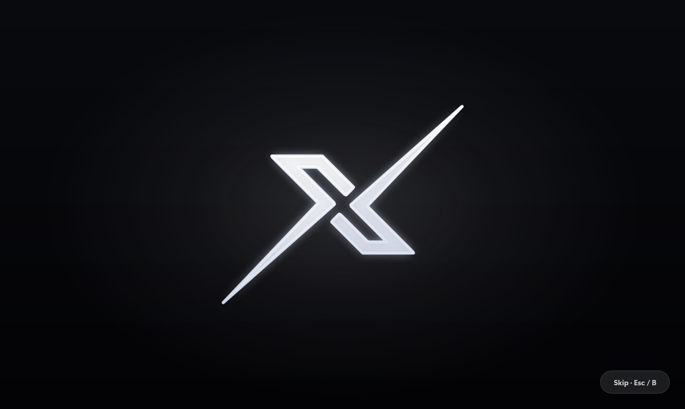
</p>

<h1 align="center">X20CTL</h1>

<p align="center"><b>A console-style controller studio for EasySMX pads, on your own PC.</b><br>
Remap buttons, shape sticks and triggers, build back-paddle macros, set vibration, and check that a controller really works.</p>

<p align="center">
  <a href="https://github.com/AmjadAAYD/x20ctl/releases/tag/v4.1.0-preview.3"><b>Download 4.1.0 Preview 3</b></a> ·
  <a href="CHANGELOG.md">Changelog</a> ·
  <a href="IF-YOUR-CONTROLLER-ISNT-WORKING.md">Controller not working?</a> ·
  <a href="https://github.com/AmjadAAYD/x20ctl/issues">Report an issue</a>
</p>

> **Not affiliated with EasySMX.** X20CTL is an independent, open-source project. It is not made, endorsed, sponsored or supported by EasySMX. Product names belong to their owners and are used only to say which controllers X20CTL works with.

---

## What's new

X20CTL is now a **native Windows app**, rebuilt from scratch in WPF on .NET 10. It no longer uses a web page inside a window, and it no longer needs WebView2. Up to four players each pick their own controller. Every model opens the same Studio, and every page can be driven with a gamepad, like a console's big-picture mode.

**4.1.0 Preview 3 is a pre-release.** The EasySMX X20 is the only verified controller. The other seven models open as read-only previews. Their layouts, sticks and triggers are drawn and animated, but nothing is written to them. See [Supported controllers](#supported-controllers).

## Controller Zone

Every launch opens with the X20CTL intro and then the Controller Zone. Each of the four players has a card. The selected card grows into the hero spot on the left, and the other three wait on the right. Press **+** on an empty card to choose a controller.

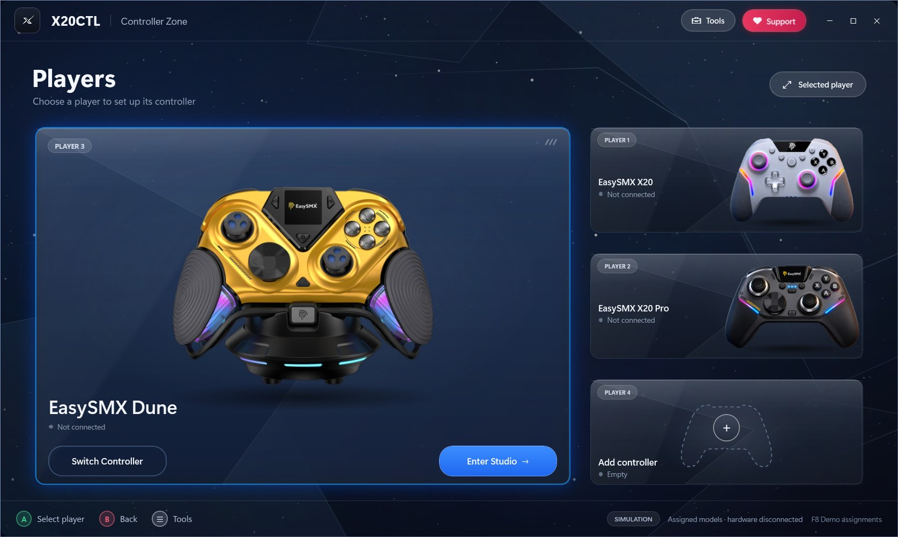

## Choose your controller

Pick the model you hold. Each card names what the pad has: stick and trigger type, lighting, screen and back buttons. Choosing a model sets the layout and tools; connecting the hardware is a separate step.

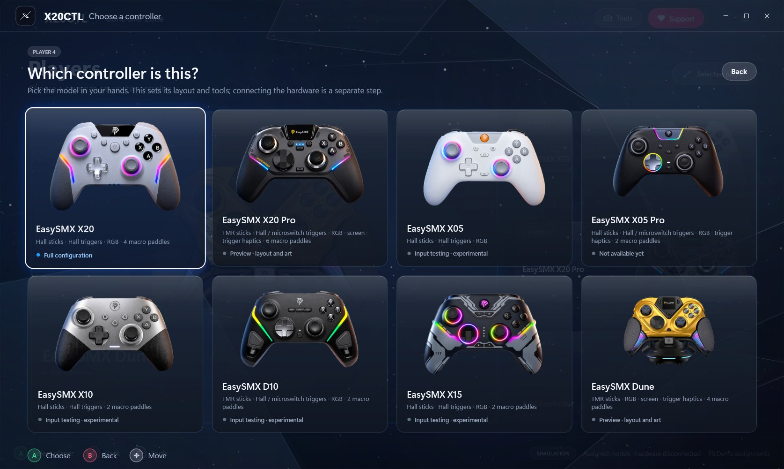

## Studio

### Dashboard

The Studio opens on the Dashboard. It shows the controller, its player slot, your draft changes and saved setups. It also finds the Steam and Epic games installed on this PC, so you can launch them from here. It only reads the launchers' own local files and never goes online.

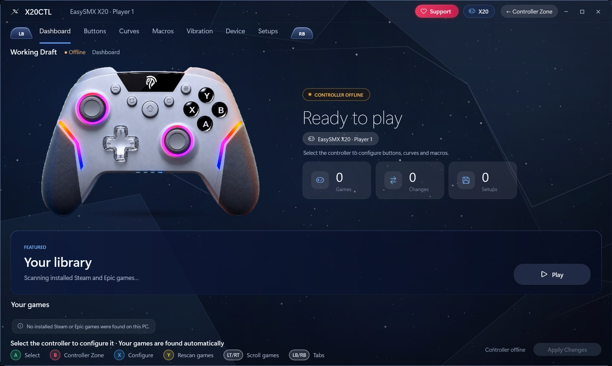

### Buttons

Pick a button on the controller, then press what it should do. Front and back views are included, plus an Outputs board of every remappable control. Use **Try it** to feel a change before you keep it.

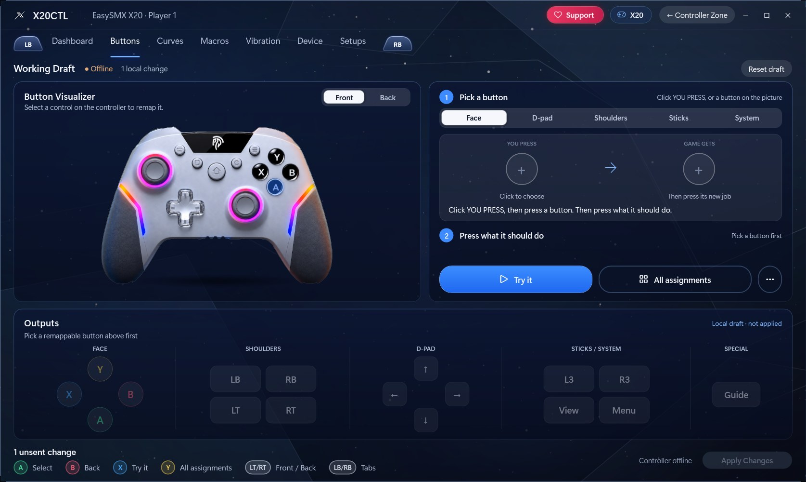

### Curves

Shape each stick and trigger separately: presets, inner deadzone and outer travel limit. The graph shows the input-to-output response you are building.

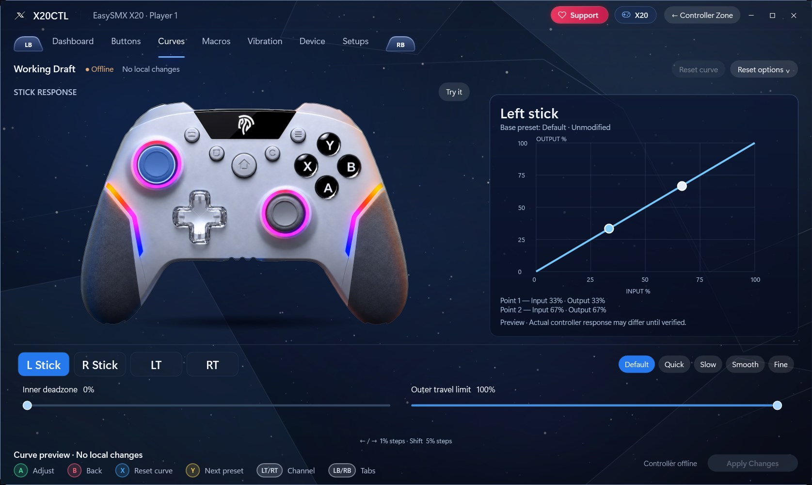

### Macros

Build sequences for the M back paddles, step by step, on a timeline. Each step holds buttons, stick directions or a pause, with its own timing. The M paddles are macro slots that send ordinary buttons. They never become extra buttons of their own.

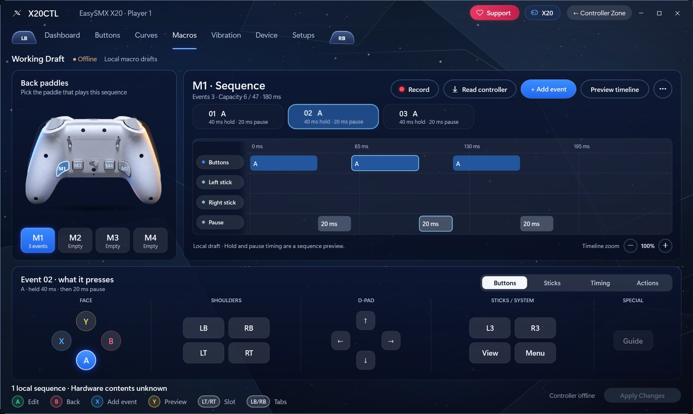

### Vibration

Set motor strength. The motors pulse on the picture like a heartbeat that speeds up as strength rises. This is a visual preview of your draft, not a reading from the motors. Only the X20 Pro and the Dune have trigger motors; every other model has two grip motors.

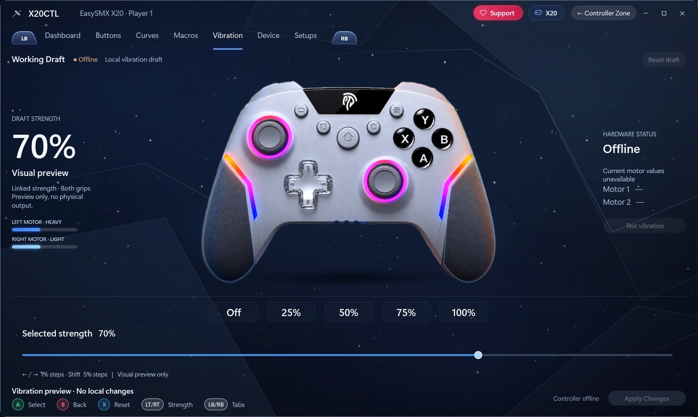

### Device

Shows the controller's battery, firmware, hardware revision and transport. Gameplay and configuration are listed as separate connections, along with what X20CTL supports on this model.

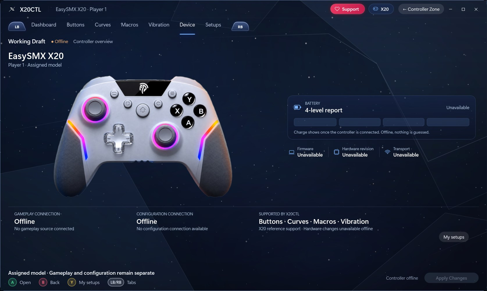

### Setups

Keep whole-controller setups in a local library: buttons, curves, macros and vibration together. Open, duplicate, rename, export and import them.

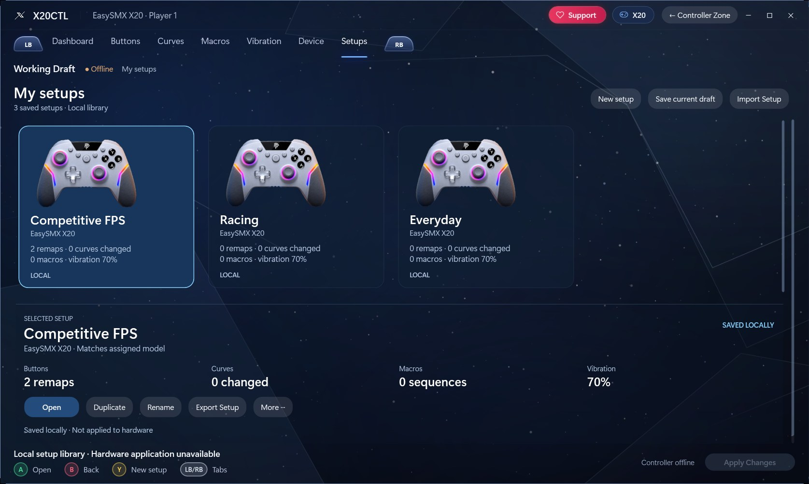

### Tester

See exactly what Windows receives from the controller: every button, both sticks and both triggers, live, with the front and back views.

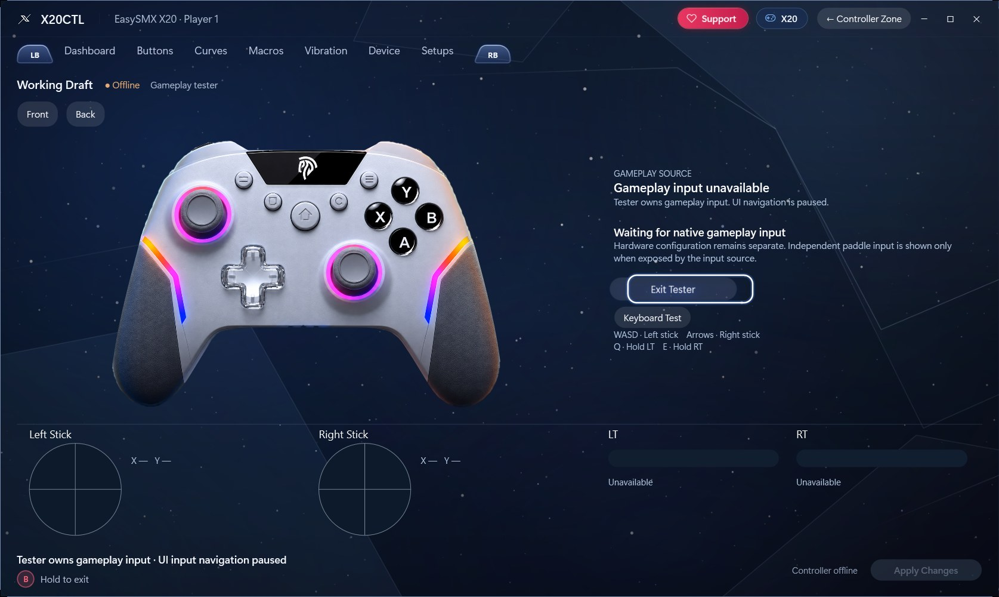

## Every controller gets the full Studio

Models that are not verified yet still open every page: Dashboard, Buttons, Curves, Macros, Vibration, Device, Setups and Tester. Each page wears a banner that states what is known about the controller and what isn't. Where sources disagree, the banner says so instead of guessing. Sticks and triggers move on every model.

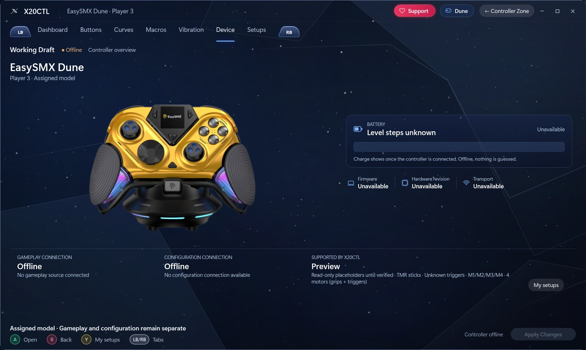

## Tools

Tools gathers help and extras: the Controller Check, Replay Intro, About, Support X20CTL and the GitHub repository.

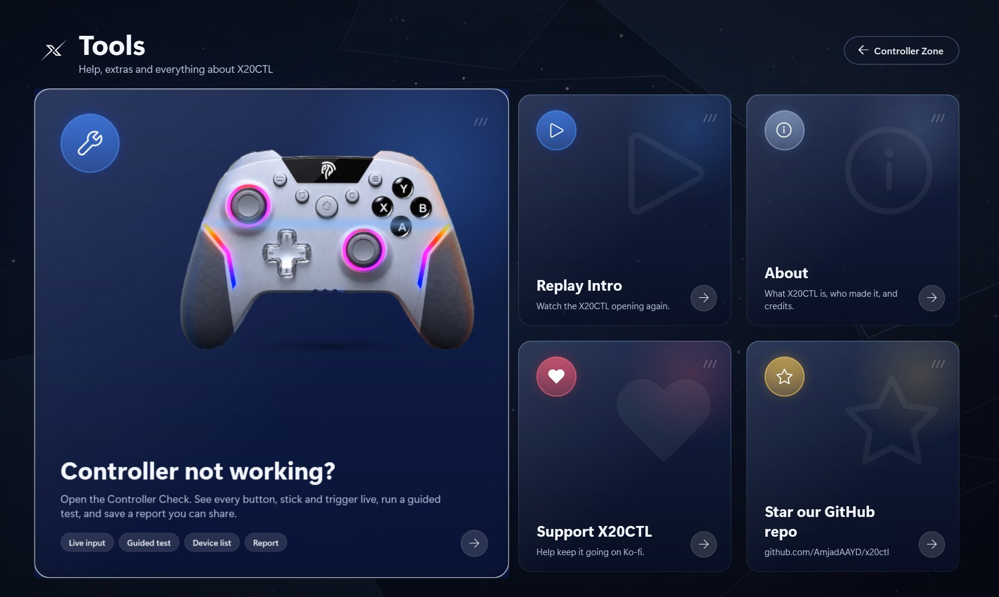

### Controller Check

Is the controller not working? The Controller Check walks you through every button, stick and trigger, one step at a time. It shows held times, the stick report rate and resolution, battery, and what the controller reports to Windows. It then saves a ZIP report to `Documents\X20CTLInputReports`.

It only reads. It never changes settings, lighting, vibration or firmware. Sending the report is your choice: before the scan starts, pick **Scan and send** or **Scan, keep it on this PC**.

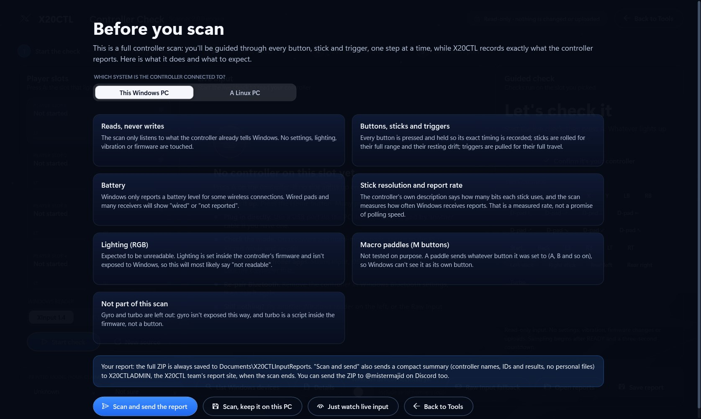

### About

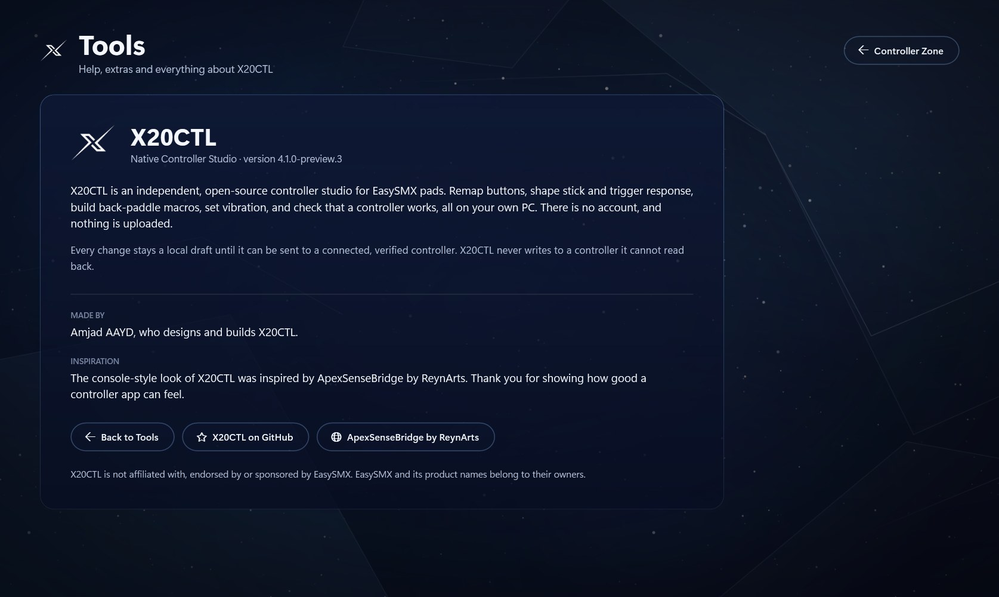

## Supported controllers

| Controller | Status in 4.1.0 Preview 3 |
|---|---|
| **EasySMX X20** | Verified. Full Studio: buttons, curves, macros (M1–M4), vibration, setups, tester |
| EasySMX X20 Pro | Read-only preview: TMR sticks, six back buttons, four motors including the triggers |
| EasySMX Dune | Read-only preview: TMR sticks, M1–M4, four motors including the triggers |
| EasySMX X15 | Read-only preview |
| EasySMX X10 | Read-only preview |
| EasySMX X05 | Read-only preview |
| EasySMX X05 Pro | Read-only preview |
| EasySMX D10 | Read-only preview |

For a preview model, nothing is written to the controller and nothing is stored as if it had been. A model becomes verified only once its settings can be read back from real hardware. Controller Check reports from owners help get each model there.

## Download

1. Open the [4.1.0 Preview 3 release](https://github.com/AmjadAAYD/x20ctl/releases/tag/v4.1.0-preview.3).
2. Download **X20CTL-4.1.0-preview.3-windows-x64.zip**, not the source-code archive.
3. Extract the whole `X20CTL` folder and run **X20Ctl.exe**.

You need Windows 10 or 11 (x64). Everything is bundled: you don't need to install .NET, Python, a browser runtime or an account.

The app is **unsigned**, so Windows SmartScreen may warn you. Check the ZIP against the release's `SHA256SUMS.txt`. Never turn off your antivirus to run it.

**Linux.** The Studio is Windows-only for now. The Linux ZIP contains the Controller Check as a standalone script (`x20ctl-check.py`, Python 3). A native Linux build of the full Studio is planned.

The last stable release is still [4.0.1](https://github.com/AmjadAAYD/x20ctl/releases/tag/v4.0.1).

## Local first

- No account. No telemetry. Your setups, drafts and assignments stay in your user folder.
- Every change is a **local draft** until it can be sent to a connected, verified controller. X20CTL never writes to a controller it cannot read back.
- The game shelf reads only the Steam and Epic launchers' own local files.
- The only uploads are a Controller Check report, and only when you choose **Scan and send**. External links, such as Support and GitHub, open in your browser and only when you click them.
- X20CTL does not flash firmware.

## Build from source

You need the .NET 10 SDK on Windows:

```powershell
git clone https://github.com/AmjadAAYD/x20ctl.git
cd x20ctl
dotnet build desktop-dotnet\X20Ctl.Product\X20Ctl.Product.csproj -c Release
```

The controller art is generated from the source pictures by `tools/build_native_controller_layers.py`, and the outlines by `tools/build_controller_outlines.py`. The protocol research and the earlier Python and React desktop lines are still in the repository: see [docs/](docs/) and the [protocol reference](docs/01-protocol.md).

## Credits

**Made by Amjad AAYD.**

The console-style look was inspired by [ApexSenseBridge by Kayn arts (ReynArts)](https://github.com/ReynArts/ApexSenseBridge). The credit is for design inspiration only; no code was taken from it. X20CTL has its own branding, artwork and implementation.

If X20CTL helps you, you can [support it on Ko-fi](https://ko-fi.com/x20ctl), or simply star the repo.

## License

From 4.1.0 Preview 3, X20CTL is free software under the **[GNU General Public License v3.0 or later](LICENSE)**. You may use, study, share and change it. If you distribute a modified version, it must stay open under the same licence.

Releases up to and including 4.1.0 Preview 2 were published under MIT, and code contributed under MIT keeps its notice ([licenses/](licenses/)). See [NOTICE](NOTICE) for details and the full non-affiliation statement.
